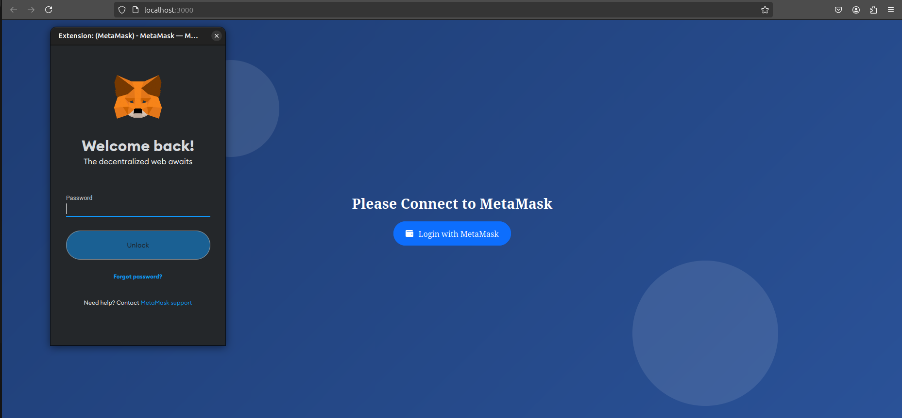
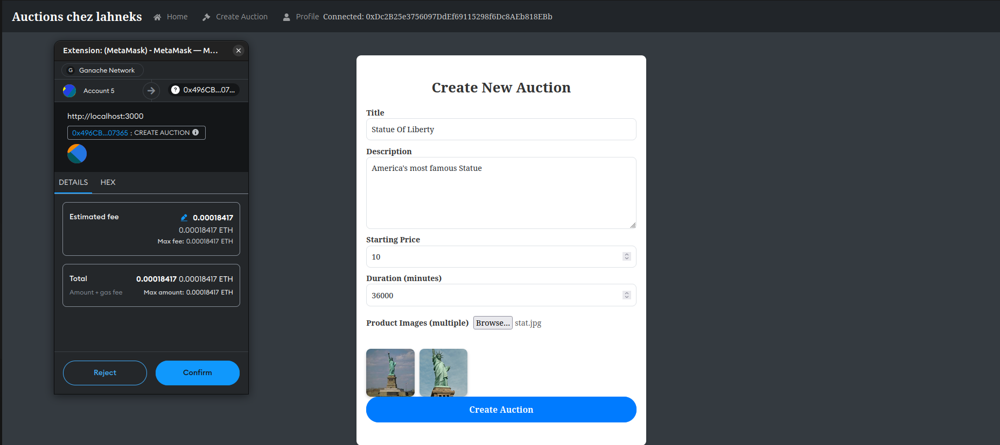
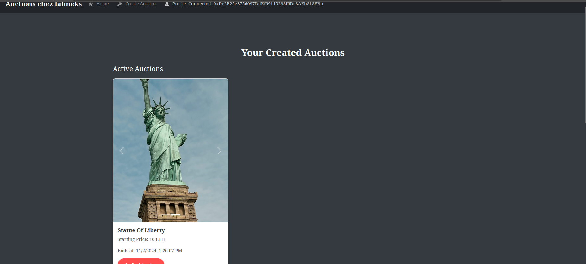
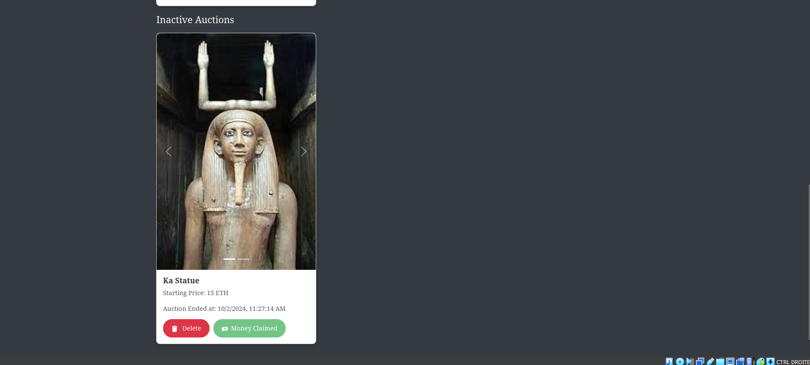
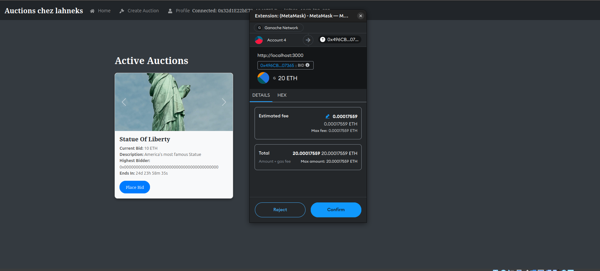

# 🏆 Auction App - README 📄

## 👥 Contributors

- Azza Shell
- Ahmed Rami Belguith
- Mohamed Taha Mourali
- Mahdi Koubaa

## 📜 Project Description

### 📸 Screenshots

- **Login with MetaMask**: 

- **Create Auction Page**: 

- **Active Auctions**: 

- **Inactive Auctions**: 

- **Place a Bid**: 
  The Auction App is a decentralized 🛍️ platform where users can create auctions, bid 🤑 on items, and manage their auction activities. This application is designed to make the auctioning process simple, transparent, and highly secure, ensuring that users can trust the platform for their auction needs. The application is divided into three main components, each offering unique functionalities to enhance the user experience:

- **🏠 Home**: Users can view 👀 and bid 💸 items available in ongoing auctions. The home page provides an intuitive layout where users can see all the active auctions and make bids directly. Each item displays all relevant details, such as the current highest bid, auction duration, and item description, making it easy for users to participate in auctions without confusion.

- **📝 Create Auction**: This section allows users to create new auctions with detailed item information. Users can set the item title, description, starting price, duration, and even add images to showcase their auction items. This feature provides complete control to users over how their items are presented, and the process is guided step-by-step to ensure a seamless experience.

- **👤 Profile**: Users can view their active and inactive auctions, end ⏹️ auctions, delete 🗑️ old ones, and claim money 💰 from ended auctions. It helps users manage their auctions effectively, allowing them to see auction statuses and easily interact with their completed auctions.

The platform leverages blockchain ⛓️ technology to ensure transparency 🔍 and security 🔒 during auction creation and bidding. By using smart contracts, the entire bidding process is handled without intermediaries, guaranteeing that users get a fair, immutable, and fully transparent auction experience. This means that every auction creation, and transaction is securely recorded on the blockchain, providing unparalleled trustworthiness.

## ✨ Features

- **💼 Smart Contract**: Tracks auction creations and bids on items. The smart contract is designed to automatically execute when conditions are met, ensuring fair competition and eliminating manual intervention.
- **🔐 Secure Authentication**: Wallet management with MetaMask 🦊, allowing users to securely log in, manage their funds, and participate in auctions. Users can easily connect their wallets to the app, ensuring their transactions are encrypted and protected.
- **⏱️ Real-Time Updates**: Provides real-time updates for active and inactive auctions, ensuring that users are always aware of the current status of auctions. Notifications are sent for bid confirmations, outbids, and auction endings, providing a dynamic and engaging user experience.

## 🛠️ Technologies Used

- **Frontend**: React.js ⚛️, which provides a responsive and user-friendly interface that makes interacting with auctions easy and intuitive.
- **Backend**: Express.js ⚙️, used to manage the application logic and interact with the database and blockchain components efficiently.
- **Database**: MongoDB 🍃, used for storing auction details, user information, and bidding history. MongoDB provides a flexible, scalable database solution that can easily handle the dynamic data requirements of an auction platform.
- **Blockchain**: Solidity ⛓️ smart contract, ensuring that the entire auction process is secure, automated, and trustless.
- **Tools**:
  - **MetaMask** 🦊: For authentication and wallet management, enabling users to securely connect their wallets and handle transactions directly from the browser.
  - **Truffle** 🍫: For compiling and deploying smart contracts. Truffle also provides testing utilities, making it easy to verify contract behavior before deploying to the blockchain.
  - **Ganache** 🥃: For creating accounts and deploying contracts locally, providing a personal Ethereum blockchain for testing and development purposes.

## 🚀 How to Run the Project

1. **Set Up Ganache 🥃**: Start Ganache to create accounts and deploy the contract locally. Ganache provides a local blockchain instance that helps in simulating the network where contracts can be tested and transactions performed without costs.
2. **Run Frontend and Backend ⚛️⚙️**: Run both the frontend and backend servers. The frontend server, powered by React.js, offers the user interface, while the backend server, using Express.js, handles business logic and interacts with the database and blockchain components.
3. **MetaMask Setup 🦊**: Install the MetaMask browser extension and log in to connect with the auction app. MetaMask serves as the bridge between the user's browser and the blockchain, enabling secure authentication and transaction management.

### Detailed Steps:

- **Clone the Repositories**: Clone the repositories for both the frontend and backend from GitHub.
- **Install Dependencies**: Use `npm install` to install the required dependencies for the frontend, backend, and smart contract.
- **Deploy Contracts**: Use Truffle to compile and migrate the smart contracts to the local Ganache instance.
- **Run Servers**: Use `npm start` to run the frontend and backend servers, making the application accessible on `localhost`.
- **Connect MetaMask**: Ensure MetaMask is set to the correct local network and connect your wallet to the application.

## 📁 Folder Structure

- **auction-app** 📂: Contains the smart contract developed in Solidity ⛓️. This folder includes all necessary contract files, migration scripts, and testing utilities. The contracts ensure that the auction process is trustless and all transactions are verifiable.
- **auction-app-front** 📂: Holds the frontend code using React.js ⚛️ and its components. It includes pages for Home, Create Auction, and Profile, as well as reusable UI components that provide a seamless user experience.
- **auction-backend** 📂: Contains the backend logic developed using Express.js ⚙️. This folder includes the server setup, API routes, database models, and middleware used for user authentication and auction management.

### Additional Information

The Auction App was built with a focus on decentralization, ensuring that no central authority has control over the auctions. All actions related to creating auctions, placing bids, and managing transactions are securely recorded on the blockchain, making it impossible to alter or manipulate any records. The use of blockchain technology also allows for a high level of transparency, giving users the confidence that all auctions are conducted fairly.

Furthermore, the UI/UX design was developed with simplicity in mind, allowing users of all technical backgrounds to easily navigate the platform. With real-time updates and notifications, users can actively engage in auctions without having to constantly check back. This user-centric approach makes the Auction App not only functional but also enjoyable to use.

The combination of cutting-edge technologies such as React, Solidity, MetaMask, and MongoDB creates a powerful and secure auction platform that redefines how auctions are conducted online. By leveraging the power of blockchain, the Auction App eliminates the need for intermediaries, reduces fees, and ensures that every user gets a fair chance to win their desired items.
